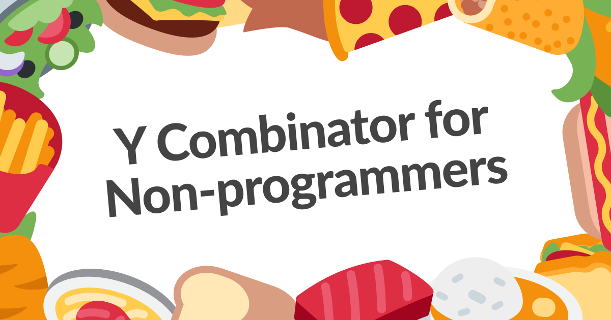

# [Y Combinator for Non-programmers](https://ycombinator.chibicode.com/)



This is the repository for **[Y Combinator for Non-programmers](https://ycombinator.chibicode.com/)** by Shu Uesugi. It also contains the code for the Japanese version: **[コンピュータサイエンスと魔法のYコンビネータ](https://yj.chibicode.com/)**

### Running it locally (English version)

```
yarn install
yarn dev:en
# Go to http://localhost:9990
```

### Stack

- [TypeScript](https://www.typescriptlang.org/), [React](https://reactjs.org/), and [Next.js](https://nextjs.org/).
- [Netlify](https://netlify.com/) for deployment
- No Google Analytics!

### License & Credits

- For emojis, I’m using [Twemoji](https://github.com/twitter/twemoji) by Twitter (CC-BY 4.0 license).
- The text for this course is licensed under [CC BY-NC-SA 4.0](https://creativecommons.org/licenses/by-nc-sa/4.0/).
- Everything else is licensed under the [MIT](docs/license-non-text.txt) license.

### Author

**Shu Uesugi**

- Twitter: [@chibicode](https://twitter.com/chibicode)
- [Website](https://chibicode.com)
- Email: [shu@chibicode.com](mailto:shu@chibicode.com)